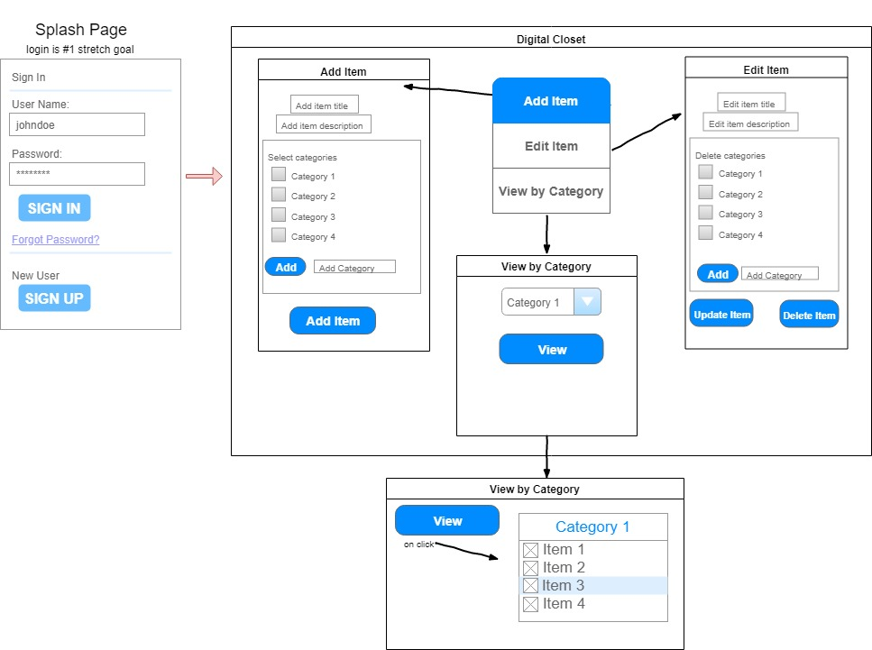

# Digital Closet

### Project’s Purpose or Goal:

### This app will allow the user to catalog & keep track of their wardrobe.

#### List the absolute minimum features the project requires to meet this purpose or goal:

* Store clothing items with different categories attached -- for example, a white t-shirt could be categorized as white, t-shirt, casual, summer, etc.
* Search for items by a single category (such as "white" or "summer" -- accomplished using drop downs)
* User will be able to add and delete items
* User's item edit function will allow them to add or delete categories

#### What tools, frameworks, libraries, APIs, modules and/or other resources (whatever is specific to yourtrack, and your language) will you use to create this MVP? List them all here. Be specific.

* React
* Firebase
* possibly Sass

#### If you finish developing the minimum viable product (MVP) with time to spare, what will you work on next? Describe these features here: Be specific.

* Add user login
* Add the ability to search by multiple categories (such as "t-shirt" and "casual" -- accomplished using checkboxes) that would return only items that match all search terms
* Store full outfits for the future week/time period, keep track of what you have worn, plan for future events so you don't wear the same thing to two weddings in a row, for example
* Have an option that tells you when you haven't worn something in a specified period of time (a digital Marie Kondo)
* An option that tells you to get rid of a clothing item if you catalog a new item (one in, one out)
* Add and store pictures of each item

#### What additional tools, frameworks, libraries, APIs, or other resources will these additional features require?

To be determined

## User Stories

* As a user, I want to be able to add clothing items to a database
* As a user, I want to be able to add categories to each clothing item
* As a user, I want to be able to search for items by category
* As a user, I want to be able to come back and edit clothing items after I have added them

#### User Stories -- stretch goals

* As a user, I want to be able to login so I can access my closet and feel secure about its contents being saved
* As a user, I want to be able to search for clothing items by multiple categories
* As a user, I want to be able to keep track of what I have worn
* As a user, I want to be able to store outfits for the future
* As a user, I want the app to tell me when I have not worn an item of clothing in a specified time period
* As a user, I want to have the accountability to get rid of one item of clothing for every item that I add
* As a user, I want to be able to upload and store pictures of each item

Work done 7/19/19:  
Have not felt comfortable with React so far, spent the day working on a tutorial[https://scrimba.com/g/glearnreact](https://scrimba.com/g/glearnreact)

Work done 7/26/19:  
8-9:30 Research on user stories and mockups  
9:30-9:45 Write user stories  
9:45-12:20 Make mockups  
12:20-1:20 lunch  
1:20-2:20 look up stuff about state, add mockup to readme  
2:30-4:45 component research, build component tree, more research on state
